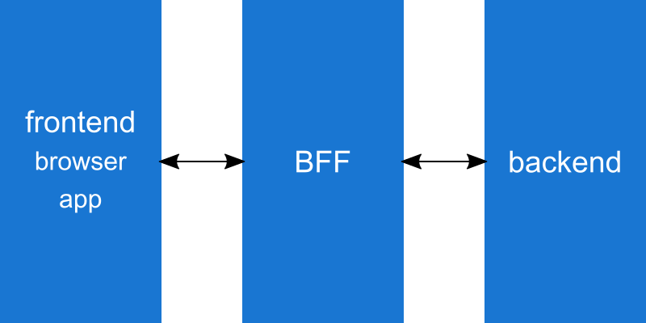
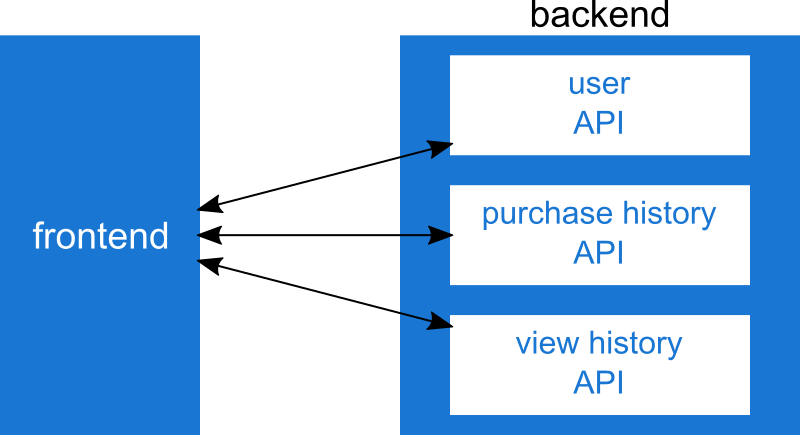
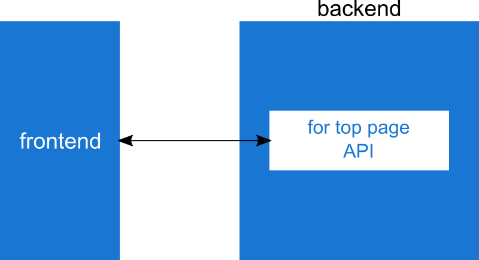
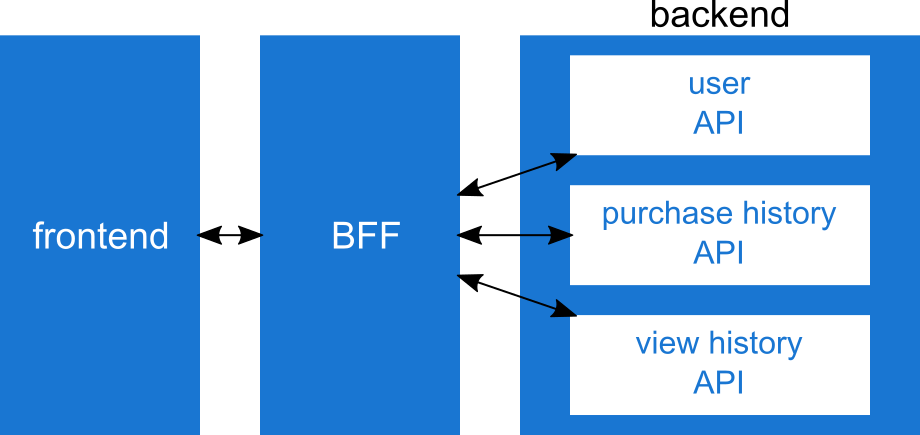

# BFF 概略
ENGINE VOL.32 @ 2019/11/28

---

## 自己紹介
- DS4 秋元祥吾
  - あっきーと呼ばれてる方です
- 趣味
  - 写真
    - 自然, 風景
  - お酒
    - ウィスキー, ラム, 日本酒
  - スノボ

---

## BFF とは？
- Backend For Frontend |

---

### 言い換えるとわかりやすい
- ~~Backend~~ For Frontend
- Server For Frontend |

---

### BFF の実態
frontend 用に構築された **単なるサーバ** でしかない

---

### BFF の存在意義の概略
- backend, frontend の折衝役

---

@snap[north]
### BFF の立ち位置
@snapend


---

### BFF の開発担当
- BE が担当するもの。 FE が担当するもの。といった厳密な定義はない |
- ただ、 FE が担当することが 多い (らしい) |
- そのため node.js で書かれることが多い |

---

### BFF を入れるメリデメ、入れないメリデメ

---

#### 導入する場合のメリデメ

---

##### メリット
- backend, frontend の 責務がしっかりわけれる |
  - backend 視点で frontend のための、 frontend 視点で backend のための処理。と言ったものがなくなる |
    - backend はマイクロサービスで開発できる|
      - 再利用性が高まる |
    - frontend は client に直接関連のあるコードのみに絞れる |
      - 表示に関わらないコードがなくなる |

---

##### デメリット
- 学習コスト, 実装コストがあがるがめ、 delivery が伸びる |

---

#### 導入しない場合のメリデメ

---

##### メリット
- 新しい概念を要さず開発を進められる |
  - 今まで通りの開発でよい |

---

##### デメリット
- プロジェクトが大きくなった場合、中間コードが増えてしまい、煩雑になる |
  - 中間コードとは前述した、backend 視点で frontend のための、 frontend 視点で backend のための処理 |

---

### 導入について
- 静的サイト、 LP 等は不要なケースが多い |
- 多様な機能 (API) をもつサイトや APP ではあるとよさそう |

---

## BFF の役割

---

### 主要な役割
- API Gateway
- Server Side Rendering 
- Session Management
- File Upload
- WebSocket、Server Sent Events、Long Polling

---

## API Gateway とは
- backend と frontend の API 通信の **仲介**

---

### 機能例
- 同時に必要な複数の **マイクロサービスの集約**
- API のレスポンスを frontend 向けに **変換**
- API のレスポンスで frontend に必要な情報だけに **フィルタリング**

---

### マイクロサービスの集約
- ユーザ情報、購入履歴、閲覧履歴が必要な画面の例 |

---

#### 非導入例1

---



---

```js
// server
// ユーザ情報取得 API
app.get("/api/user/:id", () => {});

// 購入履歴
app.get("/api/user/:id/purchase/history", () => {});

// 閲覧履歴
app.get("/api/user/:id/view/history", () => {});

// client
document.addEventListener("DOMContentLoaded", (event) => {
  const screenInfo = await Promise.all(
    fetch("/api/user/user123"),
    fetch("/api/user/user123/purchase/history"),
    fetch("/api/user/user123/view/history"),
  );
});
```

@snap[north span-100]
#### 非導入例 - 1
@snapend
@[1-9](server: マイクロサービスで開発ができる)
@[11-18](client: 画面に必要な API をすべて呼ばなければいけない)

---

#### 非導入例2

---



---

```js
// server
// トップ用 API
app.get("/api/user/:id/top", () => {});

// client
document.addEventListener("DOMContentLoaded", (event) => {
  const screenInfo = fetch("/api/user/user123/top");
});
```

@snap[north span-100]
#### 非導入例 - 2
@snapend
@[1-3](server: 画面固有の API を開発しなければいけない)
@[5-8](client: 画面固有の API を一つだけ呼べばOK)

---

#### 導入例

---



---

```js
// server
// ユーザ情報取得 API
app.get("/api/user/:id", () => {});

// 購入履歴
app.get("/api/user/:id/purchase/history", () => {});

// 閲覧履歴
app.get("/api/user/:id/view/history", () => {});

// client
document.addEventListener("DOMContentLoaded", (event) => {
  const screenInfo = fetch("/api/user/user123/top");
});
```

@snap[north span-100]
#### 導入例 1/2
server & client
@snapend

@[1-9](マイクロサービスで開発ができる)
@[11-14](画面固有の API を一つだけ呼べばOK)

---

```js
// bff
app.get("/api/user/:id/top", async (req, res) => {
  const { userId } = req.params
  const screenInfo = await Promise.all(
    fetch(`/api/user/${userId}`),
    fetch(`/api/user/${userId}/purchase/history`),
    fetch(`/api/user/${userId}/view/history`),
  );
  res.json(screenInfo);
});
```

@snap[north]
#### 導入例 2/2
BFF
@snapend

---

### レスポンスの変換
- 外部API を使う時の例 |

---

```js
// client
document.addEventListener("DOMContentLoaded", function(event) {
  const contactList = fetch("https://api.outside-api.com/contacts");
  contactList.forEach((contactInfo) => {
    console.log(contactInfo.account_id);
  });
});
```

@snap[north span-100]
#### 非導入例
@snapend

@[5](プロパティ名が FE の慣習に習ってない。 eslint に引っかかったりする)

---

```js
// client
$(async () => {
  const contactList = fetch("/api/outside-api/contacts");
  contactList.forEach((contactInfo) => {
    console.log(contactInfo.accountId);
  });
})();
```

@snap[north span-100]
#### 導入例
@snapend

@[5](プロパティ名が FE の慣習に倣ってる)

---

```js
// bff
app.get("/api/outside-api/contacts", (req, res) => {
  const contactList = fetch("https://api.outside-api.com/contacts");
  const responseData = contactList.map((contactInfo) => ({
    accountId: contactInfo.account_id,
  }));
  res.json(responseData);
});
```

@snap[north span-100]
レスポンスの変換: 導入例
@snapend

@[4-7](プロパティ名を BE の慣習から FE の慣習に変換する)

---

### レスポンスのフィルタリング
- 外部API を使う時の例 |

---

```js
// client
document.addEventListener("DOMContentLoaded", function(event) {
  const contactList = fetch("https://api.outside-api.com/contacts");
  contactList
    .filter((contactInfo) => contactInfo.department === "Development")
    .forEach((contactInfo) => {
      console.log(contactInfo.account_id);
    });
});
```

@snap[north span-100]
#### 非導入例
@snapend

@[5](必要最低限の情報しか帰ってこなければ不要な処理)

---

### レスポンスのフィルタリング

---

```js
// client
document.addEventListener("DOMContentLoaded", function(event) {
  const contactList = fetch("/api/outside-api/contacts");
  contactList.forEach((contactInfo) => {
    console.log(contactInfo.accountId);
  })
});
```

@snap[north span-100]
#### 導入例 1/2
client
@snapend

@[3-6](帰ってきた情報をそのまま処理できる)

---

```js
// bff
app.get("/api/outside-api/contacts", (req, res) => {
  const contactList = fetch("https://api.outside-api.com/contacts");
  const responseData = contactList
    .filter((contactInfo) => contactInfo.department === "Development")
    .map((contactInfo) => ({
      accountId: contactInfo.account_id,
    }));
  res.json(responseData);
});
```

@snap[north span-100]
#### 導入例 2/2
BFF
@snapend

@[5](不要な情報をフィルタリングして client に情報を渡す)

---

## 導入・実装した所感
- 立ち上げは大変 |
  - server の知見がないので、実装に苦戦 |
- それなりに実装できたら |
  - backend, frontend のコードがいい感じになる |
    - backend: マイクロサービスで開発できている |
      - 再利用性が高まる |
    - frontend: server とつながる周りのコードがシンプルになる |
---

## 総括 (っぽいもの)
- 今日ご紹介したのはほんの一部の機能 |
- BFF の可能性はすさまじい |
- ただ BFF に頼りすぎるとカオスになるので注意が必要 |

---

## fin.
ご静聴ありがとうございました
